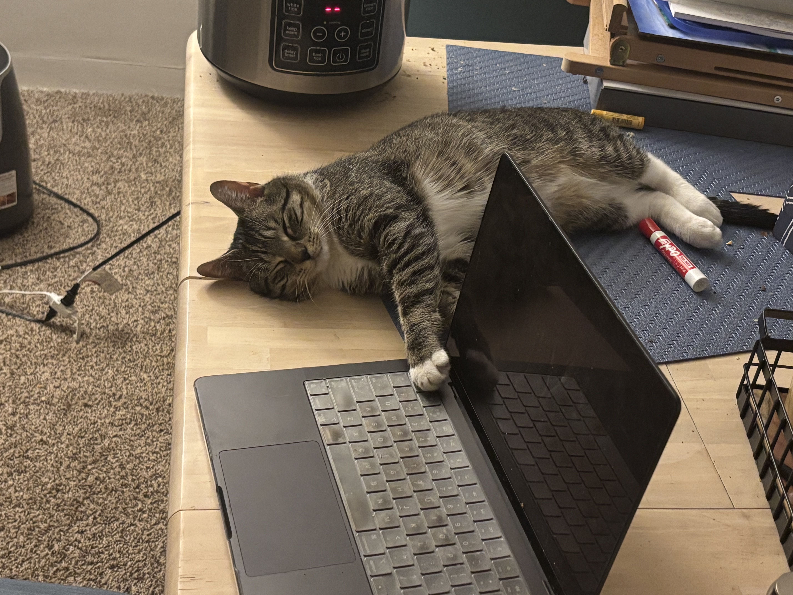

# 🐾 PawFreeze

Tries to make your pc cat🐱-typing safe.

[▶️ Watch Demo on YouTube](https://www.youtube.com/watch?v=XxeDfOaT0Js)




---

## How it works

A local VLM (via Ollama) watches your webcam. When it sees a cat, your keyboard locks. Hold `Esc` for 1.5s to unlock.

Three modes — switch with **1/2/3** in the window:

| Mode | Behaviour |
|---|---|
| `1` VLM only | Locks on any keypress while cat is visible |
| `2` Keyboard only | Locks on typing velocity spike (>12 keys/sec) |
| `3` VLM + Keyboard | Locks on velocity spike **and** cat visible |

---

## Setup

**1. Install Ollama and pull a model**
```bash
ollama pull qwen3.5:0.8b      # recommended --> use lighter model for faster response
```

**2. Install dependencies**
```bash
uv sync
```

**3. Grant Accessibility access** (required for key blocking)

1. Open **System Settings** → **Privacy & Security** → **Accessibility**
2. Click **+** and add your terminal app (Terminal, iTerm2, Warp, etc.)
3. Toggle it **on**

> Already running? Restart PawFreeze after granting access.

**4. Run**
```bash
uv run pawfreeze
```

---

## Configuration

All tunables are in `PawFreeze/config.py`:

```python
VLM_MODEL      = "qwen3.5:0.8b"   # swap for "qwen3-vl:8b", "moondream", etc.
VLM_INTERVAL   = 2.0              # seconds between scans
VLM_TIMEOUT    = 60               # increase for large models on cold start
CAT_SIGNAL_TTL = 3.0              # seconds a detection stays active
```

---

## Tests

```bash
uv run pytest .
```